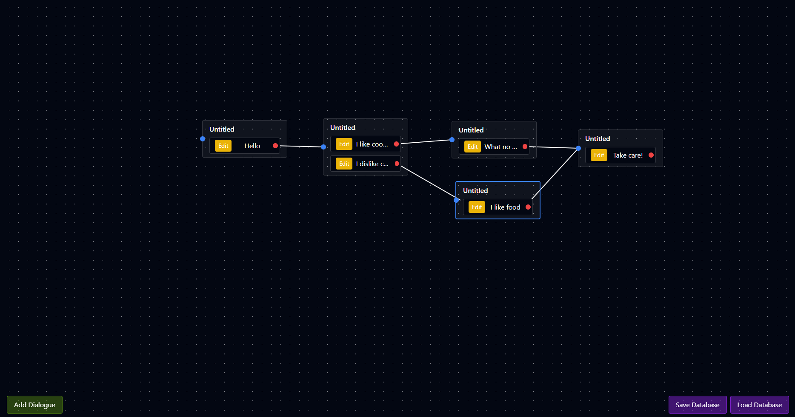

# Payung Event Editor

<i>Current state</i>

---

A simple node editor module for payung event datatype. To be integrated with Payung engine later on for Visual Novel and RPGM type game.

## Known Issues
Bugs and glitches:
- [x] Focus outline does not dissapear sometimes
- [x] Relational line is drawn incorrectly if zoom changes from default
- [x] Scene, dialogues et cetera is not saved when saving db
- [ ] SFX must be readded each time user edits detail sprite
- [ ] Sometimes the line goes off
- [ ] Drag connection doesn't work
- [ ] WHen a sprite is deleted it cannot be added back until two scenes is focued and unfocused

## Features
Todo List:
- [x] Conditionals for choicces
- [x] Flag requirement choices
- [x] Load from SQLite
- [x] Save to SQLite
- [X] SFX For sprites
- [X] Music player for event
- [X] Integrate with scene editor (upcoming)
- [x] Zoom In/Out for more working space
- [x] Panning
- [ ] Move event without choice
- [ ] Color coded actor
- [ ] Scene title
- [ ] Flags gained
- [ ] Flags remove
- [ ] Item gain
- [ ] Item remove

